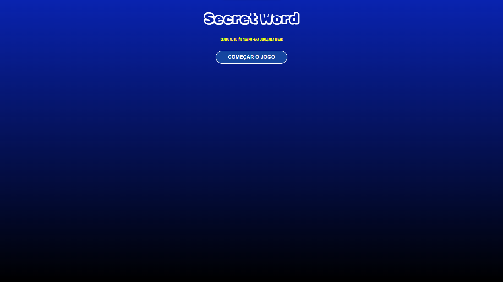
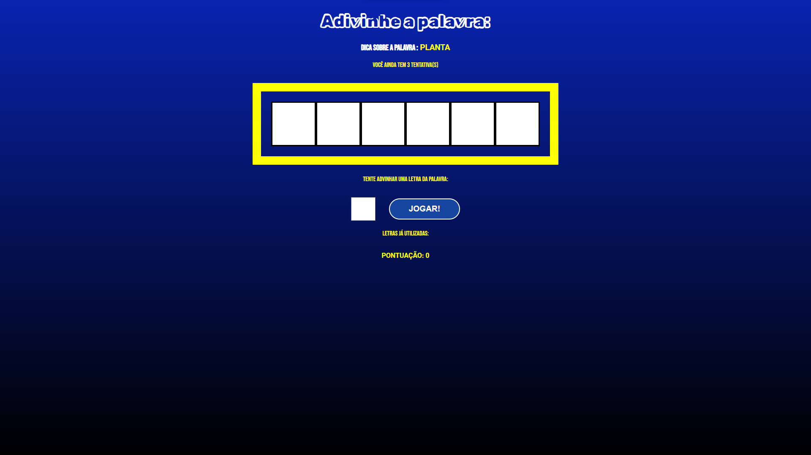
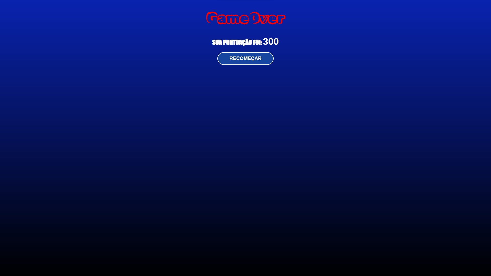

# SECRETWORD
## Jogo de Palavras em React

Bem-vindo ao Jogo de Palavras! Este jogo foi desenvolvido em React e tem como objetivo desafiar seu conhecimento de palavras e temas. Teste suas habilidades de adivinhação e veja quantos pontos você consegue acumular!

## Como Jogar

1. **Receba um Tema:** Ao iniciar o jogo, você receberá um tema específico.
2. **Adivinhe as Letras:** Com base no tema, adivinhe as letras que compõem a palavra associada.
3. **Acumule Pontos:** Cada palavra corretamente adivinhada soma 100 pontos ao seu total.
4. **Prossiga para a Próxima Palavra:** Após acertar uma palavra, você avança para a próxima.
5. **Cuidado com os Erros:** O jogo termina quando você errar 3 letras.
6. **Reinicie:** Quando o jogo terminar, as pontuações serão zeradas e você pode recomeçar.

## Funcionalidades

- **Interface Intuitiva:** O jogo possui uma interface fácil de usar e visualmente agradável.
- **Pontuação Automática:** A pontuação é calculada automaticamente, proporcionando uma experiência de jogo contínua.
- **Reinício Fácil:** Reinicie o jogo facilmente após o game over e tente novamente para bater seu recorde.

## Tecnologias Utilizadas

- React
- JavaScript
- HTML5
- CSS3

## Imagens do Jogo

### Tela Inicial

### Tela do Jogo

### Tela de Game Over

## Sobre este Projeto
Este projeto foi realizado como parte do desenvolvimento de um curso completo de React na Udemy com o professor [Matheus Battisti](https://github.com/matheusbattisti)
